# 🧠 SynapseOS

> **A full-stack cognitive productivity and academic workflow platform engineered for students, self-directed learners, and competitive programmers.**

[](https://github.com/Shubh-938croton/SynapseOS)
[](https://github.com/Shubh-938croton/SynapseOS/blob/main/LICENSE)
[](https://react.dev/)
[](https://nodejs.org/)
[](https://www.mysql.com/)
[](https://vercel.com/)

🌐 **Live Application:** [https://synapse-os-kappa.vercel.app](https://synapse-os-kappa.vercel.app)  
💻 **GitHub Repository:** [https://github.com/Shubh-938croton/SynapseOS](https://github.com/Shubh-938croton/SynapseOS)  
📚 **Complete Documentation Hub:** [docs/README.md](docs/README.md)

---

## 📖 About SynapseOS

**SynapseOS** is an open-source productivity operating system designed to bring deep-work focus, structured academic planning, markdown notes, task execution, coding contest tracking, and cognitive analytics into a single cohesive workspace.

Instead of switching between disconnected tools for tasks, timers, notes, calendar schedules, and contest tracking, SynapseOS connects everything around **Subjects** — allowing students and developers to maintain momentum, measure study velocity, and build long-term consistency.

---

## ✨ Key Features

| Module | Description | Status |
| :--- | :--- | :---: |
| **📊 Command Center** | Contextual greeting, study summaries, task counters, and quick actions | ✅ Production Ready |
| **🔐 Dual Authentication** | Email/Password with bcrypt + Google OAuth 2.0 Single Sign-On | ✅ Production Ready |
| **📚 Subject Subsystem** | Course management, custom color tags, and inline modal creation | ✅ Production Ready |
| **✅ Task Engine** | Subject-scoped tasks with priority badges, deadlines, and filters | ✅ Production Ready |
| **📝 Knowledge Base** | Markdown-enabled revision notes with pinning and instant search | ✅ Production Ready |
| **🎯 Goal Tracker** | Long-term target tracking with 0–100% interactive progress meters | ✅ Production Ready |
| **📅 Smart Calendar** | Academic milestones integrated dynamically with coding contests | ✅ Production Ready |
| **⏱️ Deep Work Sessions** | Study session logger with automatic start/end duration computation | ✅ Production Ready |
| **🍅 Pomodoro Engine** | 25/5/15 focus intervals, cycle timers, and session audit history | ✅ Production Ready |
| **🏆 Contest Tracker** | LeetCode, Codeforces, CodeChef, HackerRank, and AtCoder tracking | ✅ Production Ready |
| **📈 Visual Analytics** | Day-by-day Recharts histograms, subject distribution, and productivity score | ✅ Production Ready |
| **🎥 YouTube Focus Hub** | Distraction-free educational search proxy and embedded player | ✅ Production Ready |
| **👤 Profile & Settings** | Account details, password security, dark/light theme, and timer configs | ✅ Production Ready |

---

## 🏗️ System Architecture

SynapseOS follows a modern, cloud-native 3-tier client-server architecture:

```text
┌─────────────────────────────────────────────────────────┐
│                    React 19 Frontend                    │
│    (Vite 8 • React Router v7 • Axios • Recharts)        │
│                Hosted on Vercel Edge                    │
└───────────────────────────┬─────────────────────────────┘
                            │
                            │ HTTPS / REST API
                            │ Authorization: Bearer <JWT>
                            ▼
┌─────────────────────────────────────────────────────────┐
│                   Express 5 Backend                     │
│    (Node.js • MVC Architecture • Google Auth Library)   │
│                 Hosted on Render Cloud                  │
└───────────────────────────┬─────────────────────────────┘
                            │
                            │ TLS 1.3 / MySQL Protocol
                            │ Parameterized SQL Queries
                            ▼
┌─────────────────────────────────────────────────────────┐
│                 Aiven Cloud MySQL 8                     │
│    (14 Relational Tables • Foreign Keys • Cascades)     │
└─────────────────────────────────────────────────────────┘
```

---

## 🛠️ Technology Stack

- **Frontend:** React 19, Vite 8, React Router DOM v7, Axios, Recharts, React Icons, React Toastify
- **Backend:** Node.js, Express 5, MySQL2 (Connection Pool), bcrypt (Salt rounds: 10), jsonwebtoken (JWT), google-auth-library
- **Database:** MySQL 8 (InnoDB Engine with Foreign Keys & Cascade Deletion)
- **Hosting & Infrastructure:** Vercel (Frontend), Render (Backend), Aiven Cloud (MySQL)

---

## ⚡ Quick Start Guide (Local Development)

### 1. Clone the Repository
```bash
git clone https://github.com/Shubh-938croton/SynapseOS.git
cd SynapseOS
```

### 2. Start the Backend
```bash
cd backend
npm install
cp .env.example .env    # Configure your MySQL credentials and JWT_SECRET
npm run dev             # Starts on http://localhost:5000
```

### 3. Start the Frontend
```bash
cd ../frontend
npm install
cp .env.example .env    # Set VITE_API_URL=http://localhost:5000/api
npm run dev             # Starts on http://localhost:5173
```

👉 *For detailed database migration steps and cloud configuration, see the **[Local Setup Guide](docs/development/setup.md)**.*

---

## 📚 Documentation Index

Explore our comprehensive documentation suite:

- **Architecture:**
  - 🏛️ [System Architecture Overview](docs/architecture/overview.md)
  - ⚙️ [Backend MVC Architecture](docs/architecture/backend.md)
  - 🎨 [Frontend SPA Architecture](docs/architecture/frontend.md)
  - 🗄️ [Database Schema & ERD](docs/architecture/database.md)
  - 🔐 [Authentication & Security Flow](docs/architecture/authentication.md)
  - 📚 [Subject Subsystem & Lifecycle](docs/architecture/subjects.md)
  - 🏆 [Contests & Calendar Integration](docs/architecture/contests-calendar.md)
- **API Reference:**
  - 📡 [Complete REST API Specification](docs/api.md)
- **Development & Operations:**
  - 💻 [Local Setup Guide](docs/development/setup.md)
  - 🛠️ [Developer Workflow & Coding Standards](docs/development/workflow.md)
  - 🚀 [Production Deployment (Vercel, Render, Aiven)](docs/development/deployment.md)
  - 🔍 [Troubleshooting Guide](docs/development/troubleshooting.md)
- **Roadmap & Contributing:**
  - 🗺️ [Project Roadmap & AI Vision](docs/roadmap.md)
  - ✨ [Full Feature Catalog](docs/features.md)
  - 🤝 [Contributing Guidelines](CONTRIBUTING.md)
  - 📜 [Changelog](CHANGELOG.md)

---
# 🧠 SynapseOS

> **A full-stack cognitive productivity and academic workflow platform engineered for students, self-directed learners, and competitive programmers.**

<div align="center">

[](https://github.com/Shubh-938croton/SynapseOS)
[](LICENSE)
[](https://react.dev/)
[](https://vite.dev/)
[](https://nodejs.org/)
[](https://expressjs.com/)
[](https://www.mysql.com/)
[](https://www.postman.com/)
[](https://vercel.com/)
[](https://render.com/)

### 🌐 Live Application

**[https://synapse-os-kappa.vercel.app](https://synapse-os-kappa.vercel.app)**

### 💻 GitHub Repository

**[https://github.com/Shubh-938croton/SynapseOS](https://github.com/Shubh-938croton/SynapseOS)**

### 📚 Documentation

**[Documentation Hub](docs/README.md)**

</div>

---

## 📸 Product Preview

SynapseOS is designed as a centralized workspace where academic planning, productivity, study tracking, notes, goals, contests, and analytics work together.

### Login Page
<p align="center">
  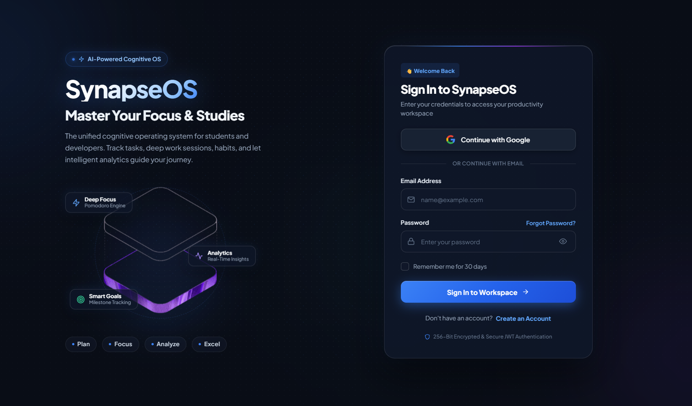
</p>

### 🏠 Dashboard

<p align="center">
  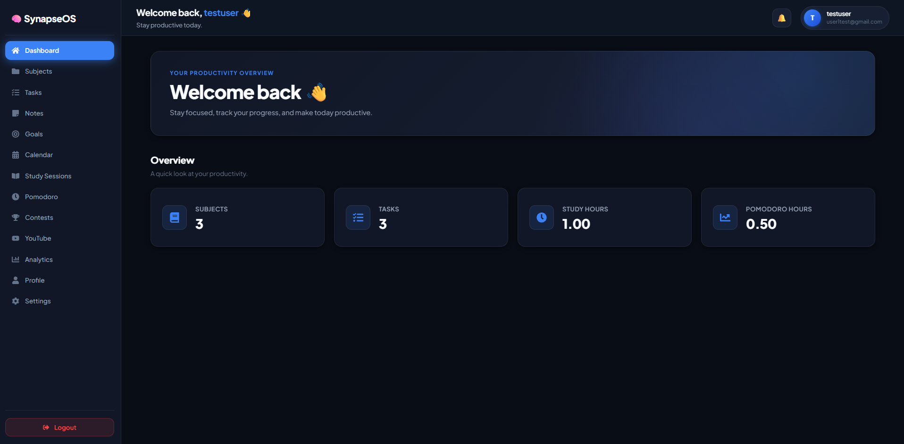
</p>

### 📚 Subjects & Academic Organization

<p align="center">
  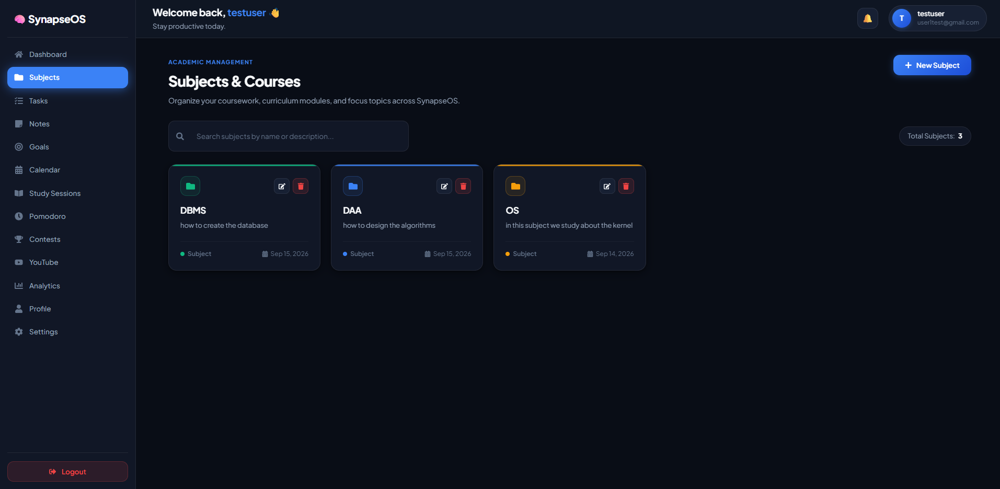
</p>

### ✅ Task Management

<p align="center">
  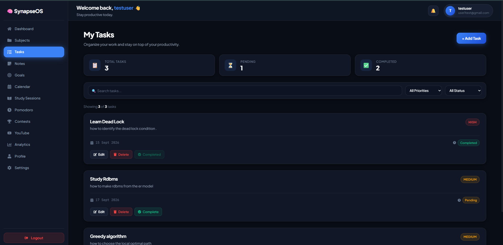
</p>

### 📝 Notes

<p align="center">
  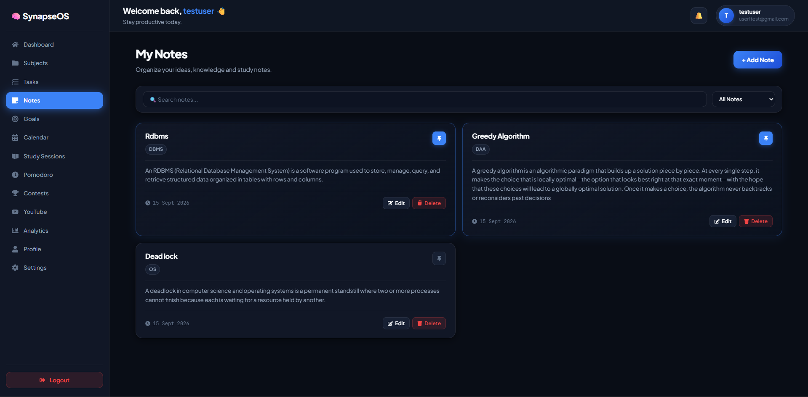
</p>

### 🎯 Goals

<p align="center">
  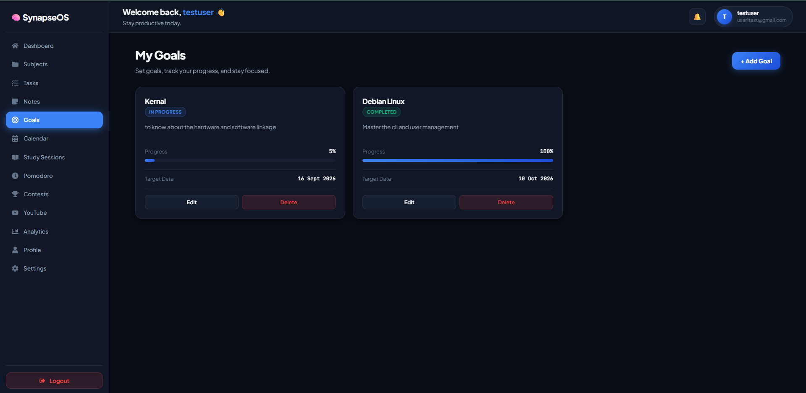
</p>

### 📅 Calendar

<p align="center">
  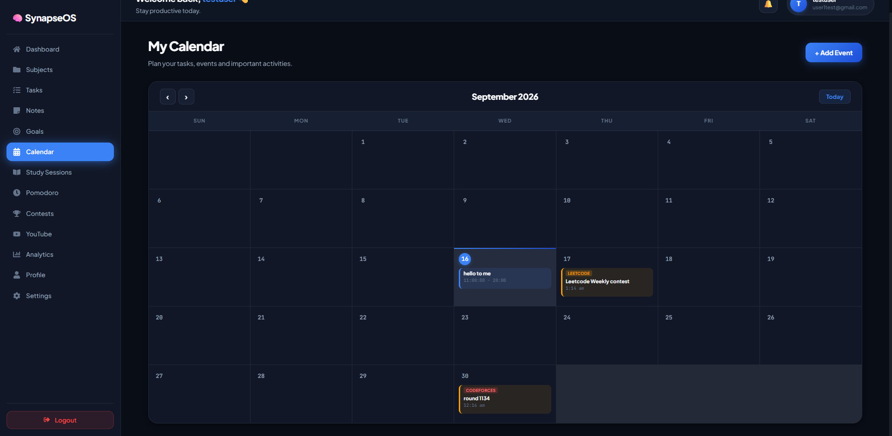
</p>

### ⏱️ Study Sessions

<p align="center">
  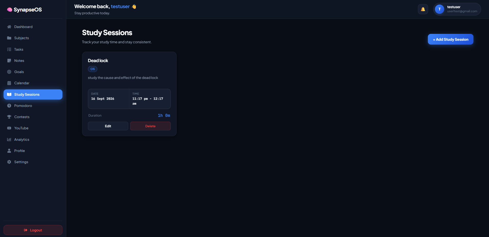
</p>

### 🍅 Pomodoro

<p align="center">
  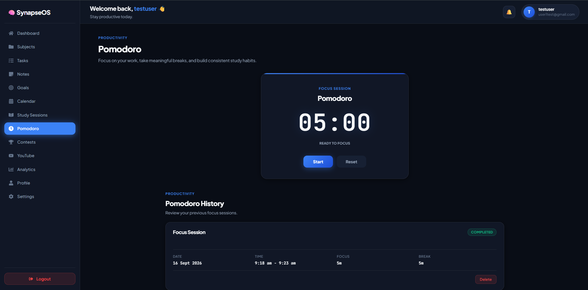
</p>

### 📈 Analytics

<p align="center">
  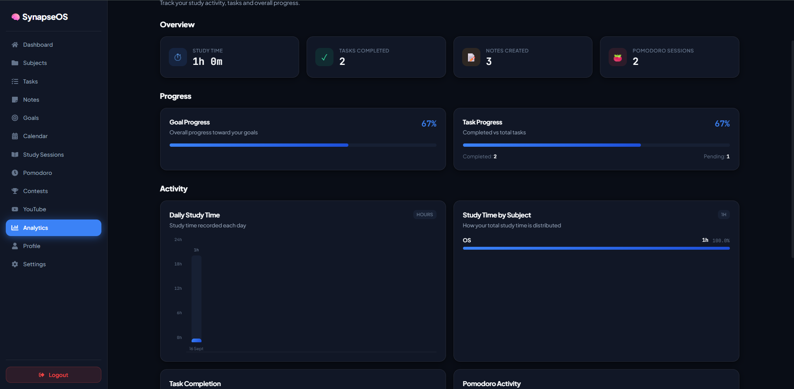
</p>

### 🏆 Coding Contests

<p align="center">
  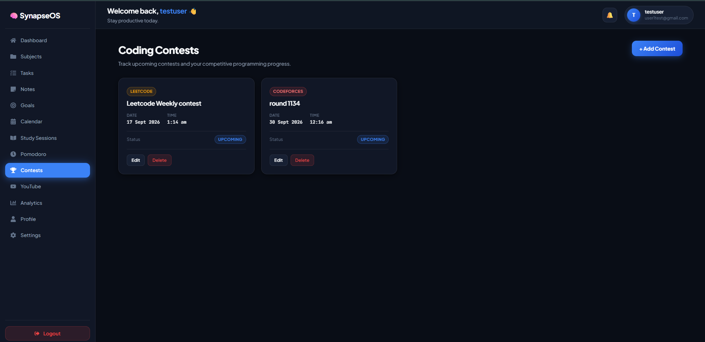
</p>

---

## 📖 About SynapseOS

**SynapseOS** is an open-source productivity operating system designed to bring deep-work focus, structured academic planning, notes, task execution, coding contest tracking, study sessions, and productivity analytics into a single cohesive workspace.

Instead of switching between disconnected tools for tasks, timers, notes, calendars, goals, and coding contests, SynapseOS connects these workflows around **Subjects**.

The platform is being developed as a long-term full-stack engineering project with an emphasis on:

- Full-stack web development
- REST API design
- Database architecture
- Authentication and authorization
- React frontend engineering
- Backend engineering
- Data-driven productivity features
- Security practices
- Cloud deployment
- Software engineering workflows

---

## ✨ Key Features

| Module | Description | Status |
| :--- | :--- | :---: |
| 📊 **Dashboard** | Contextual greeting, productivity summaries, task counters, and quick actions | ✅ |
| 🔐 **Authentication** | Email/password authentication with bcrypt and Google OAuth | ✅ |
| 📚 **Subjects** | Create and manage subjects with custom organization and color tags | ✅ |
| ✅ **Tasks** | Subject-scoped tasks with priorities, deadlines, filtering, and completion tracking | ✅ |
| 📝 **Notes** | Markdown-enabled notes with search and pinning functionality | ✅ |
| 🎯 **Goals** | Long-term goals with interactive progress tracking | ✅ |
| 📅 **Calendar** | Academic events and coding contest integration | ✅ |
| ⏱️ **Study Sessions** | Track study sessions and automatically calculate duration | ✅ |
| 🍅 **Pomodoro** | Focus/break cycles with configurable timer settings and session history | ✅ |
| 🏆 **Contest Tracker** | Track programming contests from supported competitive-programming platforms | ✅ |
| 📈 **Analytics** | Study-time, subject distribution, and productivity analytics | ✅ |
| 🎥 **YouTube Focus Hub** | Educational video workflow and embedded player infrastructure | 🔧 |
| 👤 **Profile & Settings** | Profile management, password security, themes, and timer configuration | ✅ |

---

# 🏗️ System Architecture

SynapseOS follows a modern **three-tier client-server architecture**.

```text
                         ┌──────────────────────────────┐
                         │       React Frontend         │
                         │                              │
                         │ React 19                     │
                         │ Vite 8                       │
                         │ React Router v7              │
                         │ Axios                         │
                         │ Recharts                      │
                         │ React Icons                   │
                         │                              │
                         │          Vercel              │
                         └──────────────┬───────────────┘
                                        │
                                        │ HTTPS
                                        │ REST API
                                        │ JWT
                                        ▼
                         ┌──────────────────────────────┐
                         │       Express Backend        │
                         │                              │
                         │ Node.js                      │
                         │ Express 5                    │
                         │ MVC Architecture             │
                         │ JWT Authentication           │
                         │ bcrypt                        │
                         │ Google OAuth                  │
                         │ Rate Limiting                 │
                         │ Helmet Security               │
                         │                              │
                         │          Render              │
                         └──────────────┬───────────────┘
                                        │
                                        │ TLS
                                        │ MySQL Protocol
                                        │ Parameterized SQL
                                        ▼
                         ┌──────────────────────────────┐
                         │        Aiven MySQL           │
                         │                              │
                         │ MySQL 8                      │
                         │ InnoDB                       │
                         │ Foreign Keys                 │
                         │ Indexes                       │
                         │ Relational Data Model        │
                         │                              │
                         └──────────────────────────────┘
```

---

# 🛠️ Technology Stack

## 🎨 Frontend

<div align="center">


</div>

### Frontend responsibilities

- Single-page application architecture
- Client-side routing
- Authentication state management
- API communication
- Task and goal management
- Notes interface
- Calendar interface
- Study-session tracking
- Pomodoro interface
- Contest visualization
- Productivity analytics
- Responsive UI
- Dark/light theme support

---

## ⚙️ Backend

<div align="center">


</div>

### Backend responsibilities

- REST API development
- MVC architecture
- Authentication and authorization
- JWT-based sessions
- Password hashing with bcrypt
- Google OAuth authentication
- Request validation
- Rate limiting
- Security headers
- CORS configuration
- Database connection pooling
- Parameterized SQL queries
- Error handling
- User-scoped data access

---

## 🗄️ Database

<div align="center">


</div>

SynapseOS uses a relational MySQL database hosted on Aiven.

The database architecture includes:

- Relational tables
- Primary keys
- Foreign keys
- Referential integrity
- Indexes
- InnoDB storage engine
- Cascading relationships
- User-scoped records
- Parameterized database queries

---

## 🧪 API Development & Testing

<div align="center">


</div>

Postman is used during backend development to test and verify REST API endpoints.

API testing covers areas such as:

- Authentication
- User profiles
- Subjects
- Tasks
- Goals
- Notes
- Calendar events
- Study sessions
- Pomodoro sessions
- Contest APIs
- Analytics
- Protected endpoints
- HTTP error responses

---

## 🚀 Deployment & Infrastructure

<div align="center">


</div>

| Layer | Technology |
| :--- | :--- |
| Frontend | Vercel |
| Backend | Render |
| Database | Aiven Cloud |
| Database Engine | MySQL 8 |
| Transport | HTTPS / TLS |
| API | REST |
| Authentication | JWT |

---

## 🔧 Development Tools

<div align="center">


</div>

Development workflow includes:

- Git
- GitHub
- VS Code
- PowerShell
- Git Bash
- npm
- Postman
- Vercel
- Render
- Aiven

---

# 🔐 Security

Security has been treated as part of the application architecture rather than an afterthought.

Current security measures include:

- JWT authentication
- bcrypt password hashing
- Protected API routes
- User-scoped database queries
- Parameterized SQL
- Authentication rate limiting
- YouTube endpoint rate limiting infrastructure
- Helmet security headers
- CORS restrictions
- Disabled `X-Powered-By`
- Sanitized production error responses
- Consistent login error messages
- HTTP/HTTPS contest URL validation
- Secure database TLS configuration

---

# ⚡ Quick Start

## 1. Clone the repository

```bash
git clone https://github.com/Shubh-938croton/SynapseOS.git
cd SynapseOS
```

## 2. Start the backend

```bash
cd backend
npm install
```

Create your environment file:

```bash
cp .env.example .env
```

Configure the required environment variables, then start the backend:

```bash
npm run dev
```

Backend:

```text
http://localhost:5000
```

## 3. Start the frontend

Open another terminal:

```bash
cd frontend
npm install
```

Create the frontend environment file:

```bash
cp .env.example .env
```

Configure:

```env
VITE_API_URL=http://localhost:5000/api
```

Then start Vite:

```bash
npm run dev
```

Frontend:

```text
http://localhost:5173
```

> For complete database setup, environment configuration, and deployment instructions, see the [Local Setup Guide](docs/development/setup.md).

---

# 📚 Documentation

SynapseOS includes a structured documentation system covering architecture, development, deployment, APIs, troubleshooting, and project evolution.

## 🏛️ Architecture

- [System Architecture Overview](docs/architecture/overview.md)
- [Backend Architecture](docs/architecture/backend.md)
- [Frontend Architecture](docs/architecture/frontend.md)
- [Database Architecture](docs/architecture/database.md)
- [Authentication & Security](docs/architecture/authentication.md)
- [Subject Architecture](docs/architecture/subjects.md)
- [Contest & Calendar Integration](docs/architecture/contests-calendar.md)

## 📡 API

- [REST API Specification](docs/api.md)

## 💻 Development

- [Local Setup Guide](docs/development/setup.md)
- [Developer Workflow](docs/development/workflow.md)
- [Production Deployment](docs/development/deployment.md)
- [Troubleshooting](docs/development/troubleshooting.md)

## 🗺️ Project Direction

- [Roadmap](docs/roadmap.md)
- [Feature Catalog](docs/features.md)
- [Contributing Guidelines](CONTRIBUTING.md)
- [Changelog](CHANGELOG.md)

---

# 🧩 Engineering Challenges Solved

Building SynapseOS involved solving several real-world full-stack engineering problems.

### 🔒 Database TLS

Configured secure MySQL connections between Render and Aiven using CA certificates and environment-based TLS configuration.

### 🌐 CORS

Configured production CORS between the Vercel frontend and Render backend while preserving local development support.

### 🐧 Linux Case Sensitivity

Resolved filename casing issues that worked locally on Windows but caused production build/deployment problems on Linux-based infrastructure.

### 🔌 API Response Mismatch

Fixed a frontend/backend contract mismatch where the contest API returned a wrapped response object while the frontend expected an array.

### 📅 Contest & Calendar Integration

Integrated contest data with the existing calendar workflow instead of treating contests as an isolated feature.

### 🍅 Pomodoro Persistence

Fixed session persistence issues involving:

- MySQL `DATETIME` handling
- Session duration calculation
- Completed/interrupted session persistence
- Frontend history refresh synchronization

### 🛡️ Security Hardening

Added:

- Authentication rate limiting
- Helmet security headers
- CORS hardening
- Error sanitization
- Login enumeration protection
- URL validation
- Dependency security updates

---

# 📊 Current Project Status

| Area | Status |
| :--- | :---: |
| Frontend | ✅ Production deployed |
| Backend | ✅ Production deployed |
| MySQL Database | ✅ Production configured |
| Authentication | ✅ |
| Subjects | ✅ |
| Tasks | ✅ |
| Notes | ✅ |
| Goals | ✅ |
| Calendar | ✅ |
| Study Sessions | ✅ |
| Pomodoro | ✅ |
| Contests | ✅ |
| Analytics | ✅ |
| Security Hardening | ✅ |
| YouTube Integration | 🔧 |
| AI Personalization | 🗺️ |
| Advanced AI Features | 🗺️ |

---

# 🗺️ Roadmap

### Phase 1 — Core Platform

- [x] Authentication
- [x] Dashboard
- [x] Tasks
- [x] Notes
- [x] Goals
- [x] Subjects
- [x] Calendar
- [x] Study Sessions
- [x] Pomodoro
- [x] Analytics
- [x] Contest Tracking

### Phase 2 — Engineering & Security

- [x] Production deployment
- [x] Database TLS
- [x] Production CORS
- [x] API hardening
- [x] Authentication rate limiting
- [x] Helmet security headers
- [x] Error sanitization
- [x] Dependency security updates
- [x] Production documentation

### Phase 3 — Intelligent Productivity

- [ ] AI productivity recommendations
- [ ] Weak-topic detection
- [ ] Personalized study planning
- [ ] Learning pattern analysis
- [ ] Intelligent reminders
- [ ] AI-assisted revision

### Phase 4 — Developer & Learning Ecosystem

- [ ] Advanced competitive-programming integration
- [ ] Learning-resource recommendations
- [ ] Deeper productivity analytics
- [ ] Research-oriented learning workflows
- [ ] Cross-platform expansion

---

# 🤝 Contributing

Contributions, suggestions, bug reports, and feature ideas are welcome.

Please read:

**[CONTRIBUTING.md](CONTRIBUTING.md)**

before submitting a pull request.

A typical contribution workflow is:

```text
Fork
  ↓
Create Branch
  ↓
Implement
  ↓
Test
  ↓
Commit
  ↓
Push
  ↓
Pull Request
```

---

# 📜 License

SynapseOS is released under the **MIT License**.

See [LICENSE](LICENSE) for the complete license text.

---

# 👨‍💻 Project

**SynapseOS** is being developed as a long-term full-stack engineering project focused on combining:

```text
Productivity
     +
Academic Planning
     +
Study Tracking
     +
Coding Practice
     +
Analytics
     +
Intelligent Personalization
```

The project is intended to evolve from a student productivity platform into a broader **personal learning and productivity operating system**.

---

<div align="center">

### 🧠 SynapseOS

**Study • Track • Build • Grow**

Built with React, Node.js, Express, MySQL, and a lot of engineering.

⭐ If you find the project interesting, consider starring the repository.

**[Live Application](https://synapse-os-kappa.vercel.app)**
&nbsp; • &nbsp;
**[GitHub](https://github.com/Shubh-938croton/SynapseOS)**
&nbsp; • &nbsp;
**[Documentation](docs/README.md)**

</div>
## 🤝 Contributing

Contributions are always welcome! Please read our **[Contributing Guidelines](CONTRIBUTING.md)** before submitting pull requests.

---

## 📄 License

This project is licensed under the [MIT License](LICENSE).