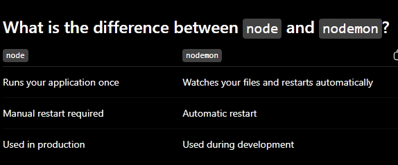
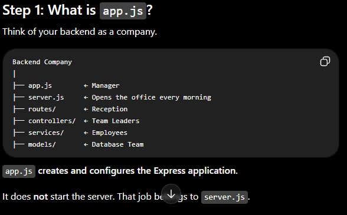

.what is semantic tags? 
.Tags which are used for suggesting the use of that particular part.
.what is nav ?
.nav is used for the link representation. it stand for the navigation which means this is used for the navigating from one page to another page . this contain the link of the other pages.

JAVASCRIPT 
five important DOM(Document Object Model) concepts:

getElementById() → Find an HTML element.
addEventListener() → Respond to user actions.
createElement() → Create new HTML elements.
appendChild() → Insert elements into the page.
classList.add() → Apply CSS classes dynamically.

Stage	  JavaScript Concept	         SynapseOS Feature
1	      Variables (let, const)	     Store tasks
2	      Functions	                     Add Task
3	      DOM Selection	                 Select buttons and inputs
4	      Events	                     Button click
5	      Strings	                     Validate input
6	      DOM Creation	                 Create task cards
7	      Arrays	                     Store multiple tasks
8	      Objects	                     Represent a task
9	      Loops	                         Display all tasks
10	      Conditionals	                 Completed vs Pending
11	      Local Storage	                 Save tasks
12	      Modules	                     Organize code
13	      Async JavaScript	             Fetch contests
14	      APIs	                         YouTube, Codeforces, GitHub
15	      ES6+	                         Modern JavaScript

# CHARACTER SET utf8mb4
"Which characters can this database store?"

What is a character set?

A character set is a collection of supported characters.

Why utf8mb4?

It supports:

English
Hindi
Japanese
Chinese
Arabic
Emojis 😊🚀❤️
Almost every modern language

# COLLATE utf8mb4_unicode_ci
This controls how MySQL compares and sorts text.

There are two related concepts:

Character Set → What characters can be stored.
Collation → How those characters are compared and ordered.

# profile_picture VARCHAR(255):
This stores the path or URL to the user's profile image.

# bio TEXT,
This stores a longer description about the user.

# updated_at TIMESTAMP DEFAULT CURRENT_TIMESTAMP
ON UPDATE CURRENT_TIMESTAMP

This tracks the last time the row was modified.

# event_date DATE NOT NULL

Stores only the date.

What is an Index?

Think of a database table as a book.

Suppose you have a 1000-page book.

You want to find the topic "Binary Search".

ON tasks(user_id)

This means

Create the index on the user_id column of the tasks table.

 # config/
Stores configuration files.
database.js

Its only job is connecting Node.js to MySQL.

# controllers/
Controllers receive the request from the frontend.

# services/
Contains the business logic.

# models/
Communicates with the database.

# routes/
Defines the API endpoints

middleware/
Runs before the controller.
Examples:

JWT Authentication
Error Handling
Request Logging
Input Validation

utils/
Helper functions.
Examples:

dateFormatter.js

generateToken.js

validators.js

app.js vs server.js
This confuses almost everyone at first.
app.js

Contains the Express application.
Think of it as the blueprint of your application.

server.js

Starts the application.
Think of it as the engine start button.

Why separate them?

Suppose later you want to:

Write automated tests
Deploy to Render
Deploy to Railway
Use Docker
Keeping app.js and server.js separate makes all of those easier. It's a common industry practice.

# What is an API?

API stands for:

Application Programming Interface

That's the full form, but it doesn't explain much.

A simpler way to think about it is:

An API is a messenger between two applications.

It takes a request from one application, passes it to another, and returns the response.

# What is Nodemon?

Nodemon is a development tool that automatically restarts your Node.js server whenever you save changes to your code.

what is app.js?

# What is express()?

Notice the parentheses:

express()

When you see parentheses after something:

something()

it usually means calling a function.

So express is actually a function.

# What is this function?
function () {
    console.log(`Server is running on port ${PORT}`);
}

This is called a callback function.

A callback is a function that runs after another operation completes.

commit like this 

feat: add task API routes
feat: connect MySQL database
feat: implement task creation endpoint
feat: add user authentication
fix: resolve database connection issue
refactor: reorganize backend folder structure
docs: update project README
style: improve dashboard UI

